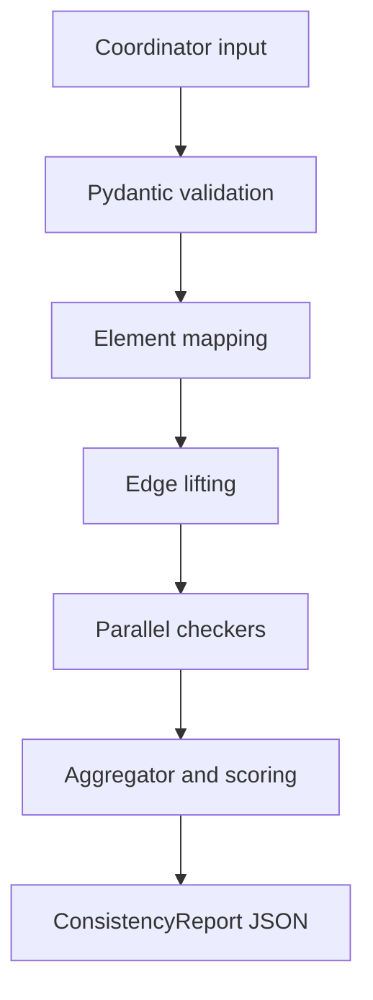

# CCA Architecture

```mermaid
flowchart TD
  A[Coordinator input] --> B[Pydantic validation]
  B --> C[Element mapping]
  C --> D[Edge lifting]
  D --> E[Parallel checkers]
  E --> F[Aggregator and scoring]
  F --> G[ConsistencyReport JSON]
```

The LangGraph StateGraph contains three stages: load/map, checker execution, and aggregation. FastAPI exposes the compiled agent to the Coordinator.
